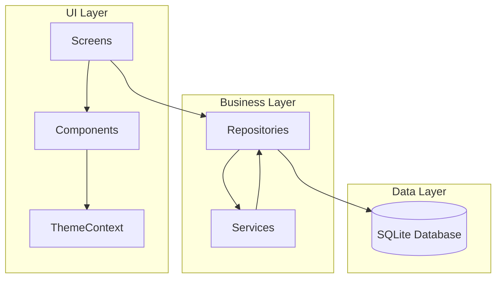
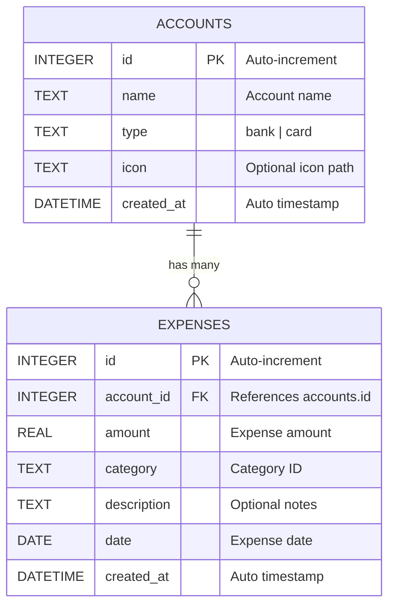
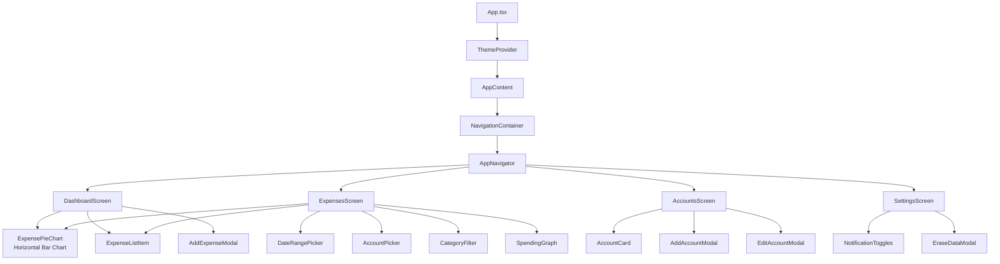
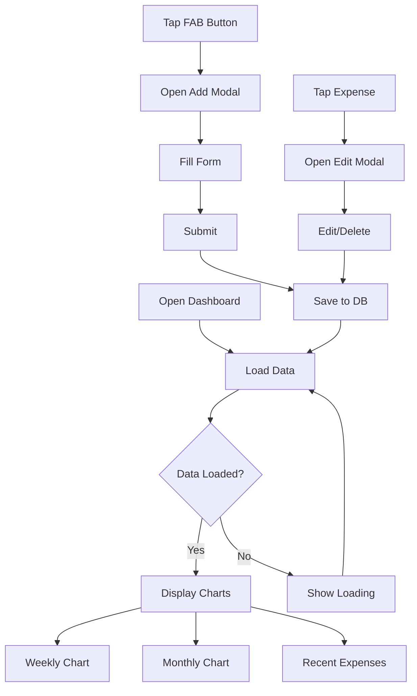
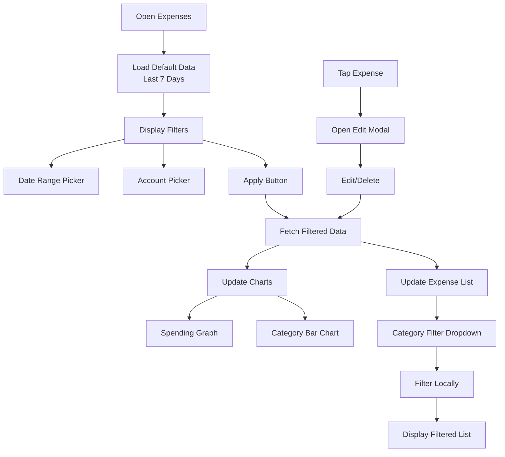
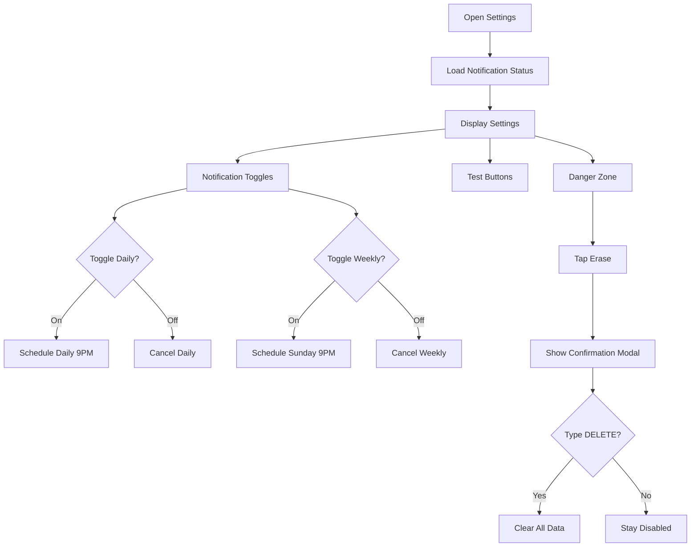
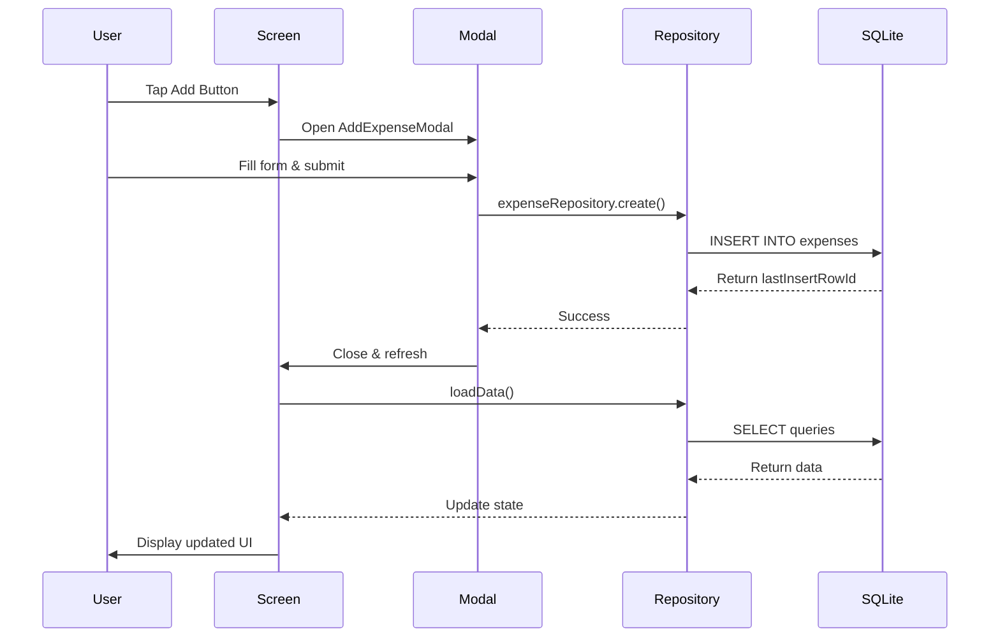
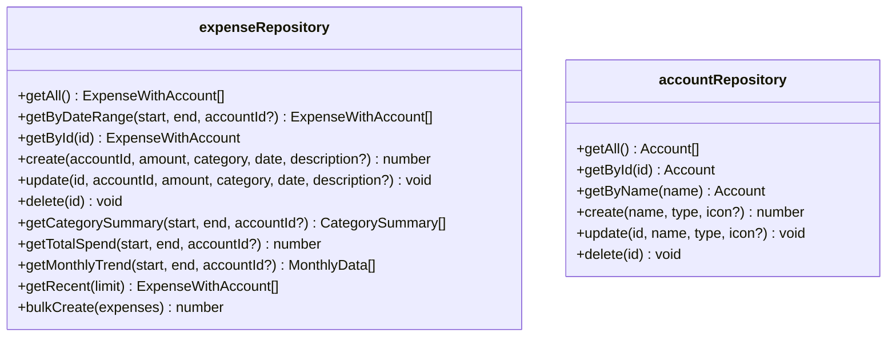
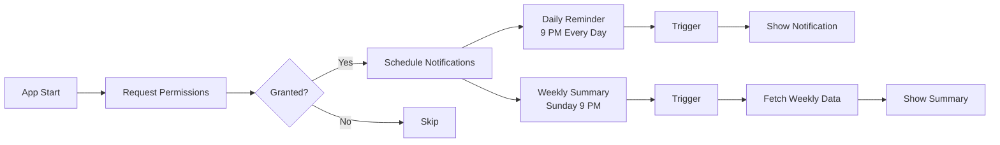

# Mark My Expense - Architecture Guide

This document provides a comprehensive overview of the application's architecture, database schema, component structure, and data flow.

## Table of Contents

1. [Application Overview](#application-overview)
2. [Database Schema](#database-schema)
3. [Component Architecture](#component-architecture)
4. [Screen Workflows](#screen-workflows)
5. [Data Flow](#data-flow)
6. [Services](#services)

---

## Application Overview

Mark My Expense is a React Native application built with Expo that follows a layered architecture:



### Architecture Layers

| Layer | Purpose | Location |
|-------|---------|----------|
| **UI Layer** | React components, screens, navigation | `src/screens/`, `src/components/` |
| **Business Layer** | Data repositories, notification services | `src/database/repositories/`, `src/services/` |
| **Data Layer** | SQLite database operations | `src/database/` |

---

## Database Schema

The application uses SQLite with two main tables:

### Entity Relationship Diagram



### Table: `accounts`

| Column | Type | Constraints | Description |
|--------|------|-------------|-------------|
| `id` | INTEGER | PRIMARY KEY, AUTO_INCREMENT | Unique identifier |
| `name` | TEXT | NOT NULL | Account display name |
| `type` | TEXT | CHECK('bank', 'card') | Account type |
| `icon` | TEXT | DEFAULT NULL | Custom icon path |
| `created_at` | DATETIME | DEFAULT CURRENT_TIMESTAMP | Creation timestamp |

### Table: `expenses`

| Column | Type | Constraints | Description |
|--------|------|-------------|-------------|
| `id` | INTEGER | PRIMARY KEY, AUTO_INCREMENT | Unique identifier |
| `account_id` | INTEGER | NOT NULL, FOREIGN KEY | Reference to accounts |
| `amount` | REAL | NOT NULL | Expense amount |
| `category` | TEXT | NOT NULL | Category identifier |
| `description` | TEXT | - | Optional description |
| `date` | DATE | NOT NULL | Date of expense |
| `created_at` | DATETIME | DEFAULT CURRENT_TIMESTAMP | Creation timestamp |

### Indexes

```sql
CREATE INDEX idx_expenses_date ON expenses(date);
CREATE INDEX idx_expenses_account ON expenses(account_id);
CREATE INDEX idx_expenses_category ON expenses(category);
```

---

## Component Architecture

### Component Hierarchy



### Component Details

| Component | Location | Purpose |
|-----------|----------|---------|
| `ExpensePieChart` | `components/ExpensePieChart.tsx` | Horizontal bar chart showing category breakdown |
| `SpendingGraph` | `components/SpendingGraph.tsx` | Line chart for 6-month spending trends |
| `CategoryFilter` | `components/CategoryFilter.tsx` | Dropdown picker for category filtering |
| `CategoryPicker` | `components/CategoryPicker.tsx` | Category selection in expense forms |
| `AccountPicker` | `components/AccountPicker.tsx` | Account selection dropdown |
| `DateRangePicker` | `components/DateRangePicker.tsx` | Date range selection with presets |
| `AddExpenseModal` | `components/AddExpenseModal.tsx` | Form for adding/editing expenses |
| `ExpenseListItem` | `components/ExpenseListItem.tsx` | Individual expense row display |
| `ThemeToggle` | `components/ThemeToggle.tsx` | Dark/Light mode toggle button |
| `AccountCard` | `components/AccountCard.tsx` | Account display card |

---

## Screen Workflows

### Dashboard Screen Flow



### Expenses Screen Flow



### Settings Screen Flow



---

## Data Flow

### Expense Creation Flow



### Data Repository Pattern



---

## Services

### Notification Service

The notification service handles scheduled push notifications:



### Notification Service API

| Method | Description |
|--------|-------------|
| `requestPermissions()` | Request notification permissions |
| `scheduleDailyReminder()` | Schedule daily 9 PM reminder |
| `scheduleWeeklySummary()` | Schedule Sunday 9 PM summary |
| `scheduleAllNotifications()` | Schedule both notifications |
| `cancelNotification(id)` | Cancel specific notification |
| `cancelAllNotifications()` | Cancel all scheduled notifications |
| `sendTestNotification()` | Send immediate test notification |
| `sendWeeklySummaryWithData()` | Send summary with actual spending data |

---

## Categories

The app includes 20 predefined expense categories:

| ID | Name | Icon | Color |
|----|------|------|-------|
| `food` | Food & Dining | 🍽️ restaurant | #22C55E |
| `rent` | Rent | 🏠 home | #14B8A6 |
| `family` | Family | 👨‍👩‍👧 people | #F97316 |
| `emi` | EMI & Loans | 💳 card | #EF4444 |
| `transport` | Travel | ✈️ airplane | #06B6D4 |
| `shopping` | Shopping | 🛍️ bag-handle | #8B5CF6 |
| `entertainment` | Entertainment | 🎮 game-controller | #EC4899 |
| `bills` | Bills & Utilities | ⚡ flash | #F59E0B |
| `health` | Health & Fitness | 💪 fitness | #10B981 |
| `education` | Education | 🎓 school | #3B82F6 |
| `personal` | Personal Care | 🧍 body | #A855F7 |
| `groceries` | Groceries | 🧺 basket | #84CC16 |
| `gadgets` | Gadgets | 📱 phone-portrait | #6366F1 |
| `trip` | Trip | 🗺️ map | #0EA5E9 |
| `investment` | Investment | 📈 trending-up | #059669 |
| `leisure` | Leisure | ☕ cafe | #D946EF |
| `office` | Office | 💼 briefcase | #78716C |
| `fuel` | Fuel | ⛽ speedometer | #EA580C |
| `kids` | Kids | 😊 happy | #FB7185 |
| `others` | Others | ⋯ ellipsis-horizontal | #64748B |

---

## Theme System

The app uses a context-based theming system:

```typescript
interface ThemeColors {
  primary: string;      // Main accent color
  background: string;   // Screen background
  surface: string;      // Card backgrounds
  surfaceVariant: string;
  text: string;         // Primary text
  textSecondary: string;
  textMuted: string;
  border: string;
  error: string;
  success: string;
  warning: string;
  tabBarInactive: string;
}
```

### Usage

```typescript
const { colors, isDark, toggleTheme } = useTheme();

// Apply colors
<View style={{ backgroundColor: colors.surface }}>
  <Text style={{ color: colors.text }}>Hello</Text>
</View>
```

---

## File Structure Summary

```
src/
├── components/          # 10 reusable UI components
├── constants/           # Categories, theme colors
├── context/             # ThemeContext provider
├── database/
│   ├── database.ts      # DB connection & utilities
│   ├── schema.ts        # Table definitions
│   └── repositories/    # Data access layer
│       ├── accountRepository.ts
│       └── expenseRepository.ts
├── navigation/          # Tab navigator setup
├── screens/             # 4 main screens
│   ├── DashboardScreen.tsx
│   ├── ExpensesScreen.tsx
│   ├── AccountsScreen.tsx
│   └── SettingsScreen.tsx
├── services/
│   └── notificationService.ts
├── types/               # TypeScript interfaces
└── utils/               # Helper functions
    ├── bankIcons.ts
    ├── csvUtils.ts
    └── dateUtils.ts
```
