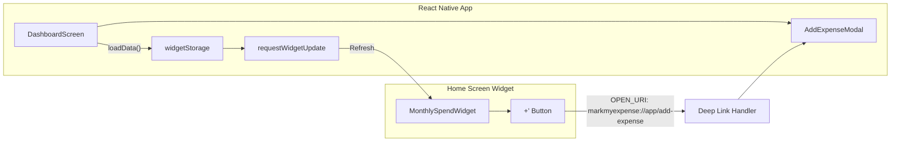

# Android Home Screen Widget - Documentation

## Overview

The Monthly Spend Widget displays current month's spending on the Android home screen with a quick-add button that opens the Add Expense modal.

---

## Architecture



---

## File Structure

```
src/
├── widgets/
│   ├── MonthlySpendWidget.tsx   # Widget UI component
│   └── widget-task-handler.tsx  # Widget lifecycle handler
├── utils/
│   └── widgetStorage.tsx        # Data sync & widget refresh
└── screens/
    └── DashboardScreen.tsx      # Handles deep link → opens modal
```

---

## Data Flow

### 1. Widget Displays Data

```
DashboardScreen.loadData()
    ↓
saveWidgetData(monthlyTotal)
    ↓
requestWidgetUpdate() → Widget re-renders with new total
```

### 2. User Taps '+' Button

```
Widget '+' Button (clickAction="OPEN_URI")
    ↓
markmyexpense://app/add-expense
    ↓
App.tsx (Linking.addEventListener)
    ↓
DeepLinkContext.shouldShowAddExpense = true
    ↓
DashboardScreen (useDeepLink hook)
    ↓
setShowAddExpense(true) → Modal opens
```

---

## Key Files

| File | Purpose |
|------|---------|
| `app.json` | Widget plugin config + deep link scheme |
| `index.ts` | Registers `widgetTaskHandler` |
| `MonthlySpendWidget.tsx` | Widget UI with FlexWidget/TextWidget |
| `widget-task-handler.tsx` | Handles `WIDGET_ADDED`, `WIDGET_UPDATE` events |
| `widgetStorage.tsx` | In-memory cache + `requestWidgetUpdate()` |
| `App.tsx` | `DeepLinkContext` for handling widget taps |
| `DashboardScreen.tsx` | Consumes context to open modal |

---

## Configuration

### app.json

```json
{
  "plugins": [
    ["react-native-android-widget", {
      "widgets": [{
        "name": "MonthlySpendWidget",
        "label": "Monthly Spend",
        "minWidth": "250dp",
        "minHeight": "100dp"
      }]
    }]
  ],
  "android": {
    "intentFilters": [{
      "action": "VIEW",
      "data": [{ "scheme": "markmyexpense", "host": "app" }],
      "category": ["BROWSABLE", "DEFAULT"]
    }]
  }
}
```

---

## Building & Testing

```bash
# Build development client (required - won't work in Expo Go)
eas build --profile development --platform android

# Install APK, then:
# 1. Long-press home screen → Widgets
# 2. Find "Monthly Spend" → Add to home screen
# 3. Tap widget to open app
# 4. Tap '+' to open Add Expense modal
```
